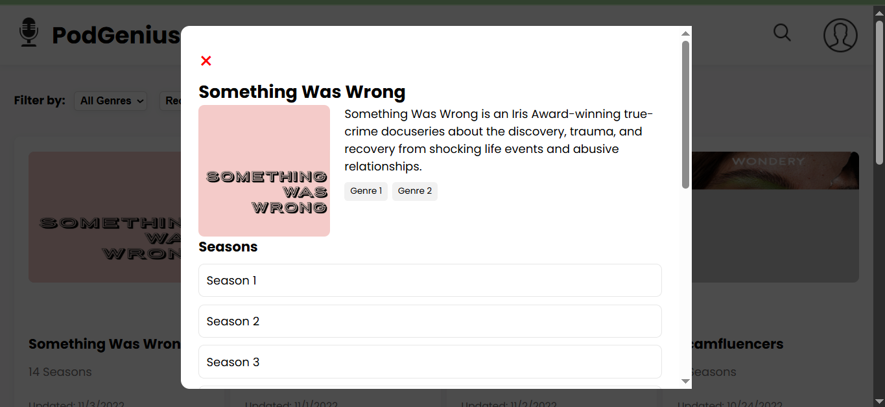
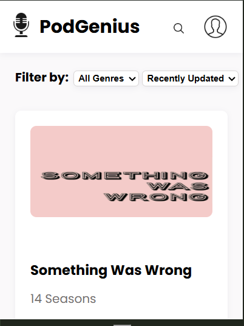

# 🎙️ PodGenius

PodGenius is a dynamic, responsive web application for exploring and discovering podcasts across a variety of genres. Users can browse popular shows, filter by categories, view detailed podcast information, and explore individual seasons.

---

## 🌟 Features

- **Browse Podcasts**: Explore a wide variety of podcasts with dynamic cards displaying show information.
- **Filter & Sort**: Filter podcasts by genre or update status (Recently Updated, Most Popular, Newest).
- **Podcast Details Modal**: Click on a podcast to view detailed info including description, genres, and seasons.
- **Responsive Design**: Fully responsive layout for desktop, tablet, and mobile devices.
- **Data-Driven**: Podcast, genre, and season data dynamically loaded from JavaScript modules.

---

## ⚡ Technologies Used

- **HTML5** – Semantic structure for clean and accessible content
- **CSS3** – Responsive layout, grid system, and modern styling
- **JavaScript (ES6 Modules)** – Dynamic rendering of podcasts, modals, and filters
- **Google Fonts** – Poppins font for modern typography

---

## 🎨 Design Highlights

- Modern card-based layout for podcasts with hover effects
- Sticky header with search and profile icons
- Filter section with dropdown menus for easy sorting
- Modal popup to display detailed information with seasons and episodes

---

## ⚙️ Setup Instructions

1. **Clone the repository**:

```bash
git clone https://github.com/Lindokuhle-dumakude/LINDUM25535_FTO2506_GroupB_Lindokuhle_Dumakude_DJS01.git
```

cd LINDUM25535_FTO2506_GroupB_Lindokuhle_Dumakude_DJS01

---

## 🚀 Usage Examples



